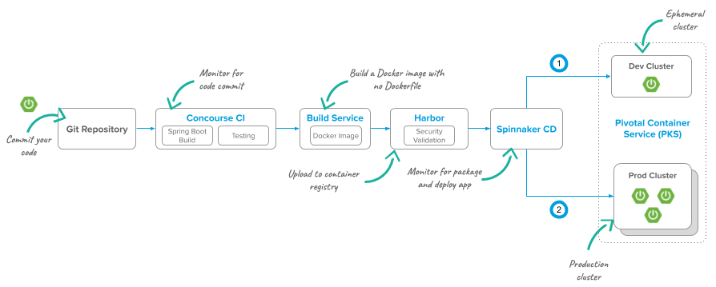
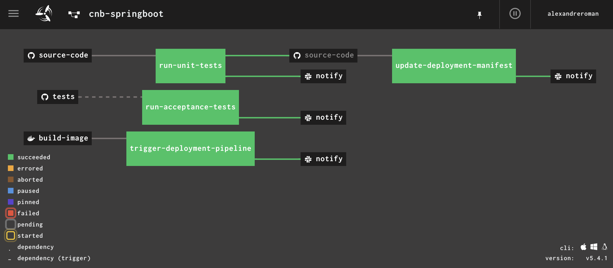
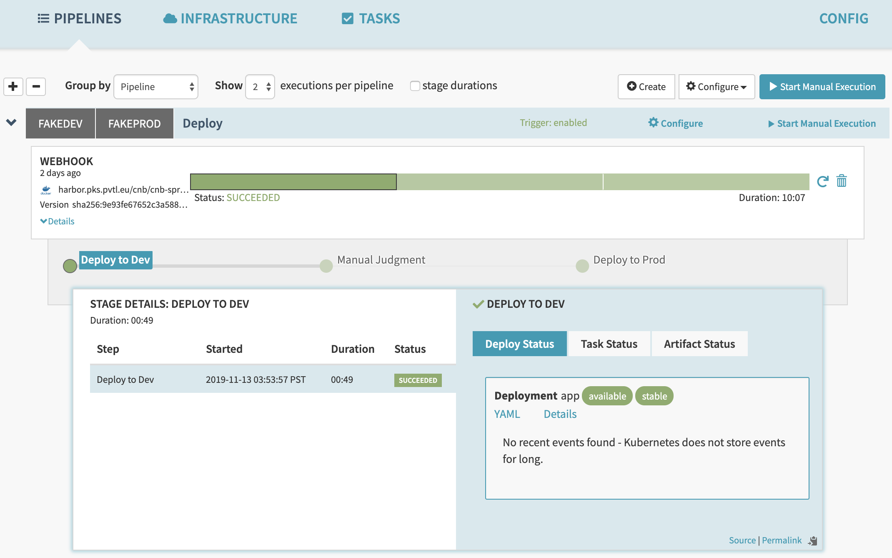

# Cloud-native Pipelines

This project defines cloud-native pipelines to deploy your apps to Kubernetes and
[Pivotal Platform](https://pivotal.io/platform), leveraging
[Concourse](https://concourse-ci.org),
[Pivotal Build Service](https://pivotal.io/pivotal-build-service),
a container registry such as [Harbor](https://goharbor.io), and
[Spinnaker](https://pivotal.io/spinnaker).

## Prerequisites

These pipelines are built with modularization in mind: you can build your own pipeline
depending on the modules you want to include. To build tailored pipelines, use the
[`ytt`](https://get-ytt.io) CLI to add overlays to a base pipeline.

## Building your pipeline

### Deploying Java apps to Kubernetes



This pipeline would build a Java application using Pivotal Build Service.
Unit tests are first executed, before an image is built with Java buildpacks.
The resulting container image is deployed to a container registry,
and then a Spinnaker pipeline is triggered to process this image.
You may also add a job to run acceptance tests using
[Cypress](https://www.cypress.io).

Base:
 - Pipeline: [`k8s-java-pipeline.yml`](k8s-java-pipeline.yml).
 - Pipeline parameters (template): [`k8s-java-app.yml.template`](k8s-java-app.yml.template)


Overlays:
 - Acceptance tests: [`acceptance-pipeline-overlay.yml`](acceptance-pipeline-overlay.yml)
 - Spinnaker: [`k8s-spinnaker-overlay.yml`](k8s-spinnaker-overlay.yml)

 Use `k8s-java-app.yml.template` to set pipeline parameters in a new file.

 Deploy this pipeline to your Concourse instance using this command:
 ```bash
 $ fly -t mytarget set-pipeline -p myapp -c k8s-java-pipeline.yml -l myapp.yml
 ```

 To enable additional modules with pipeline overlays, use `ytt`:
 ```bash
 $ ytt -f k8s-java-pipeline.yml -f acceptance-pipeline-overlay.yml -f k8s-spinnaker-pipeline-overlay.yml > myapp-pipeline.yml
 ```

Then reuse the same command to deploy this custom pipeline to Concourse:
```bash
fly -t mytarget set-pipeline -p myapp -c myapp-pipeline.yml -l myapp.yml
```



The Spinnaker pipeline is triggered using a webhook you must define
in your configuration. This webhook must accept a reference to a container image
as input parameters (previously built by Pivotal Build Service
and deployed to your container registry.



## Contribute

Contributions are always welcome!

Feel free to open issues & send PR.

## License

Copyright &copy; 2019 [Pivotal Software, Inc](https://pivotal.io).

This project is licensed under the [Apache Software License version 2.0](https://www.apache.org/licenses/LICENSE-2.0).
